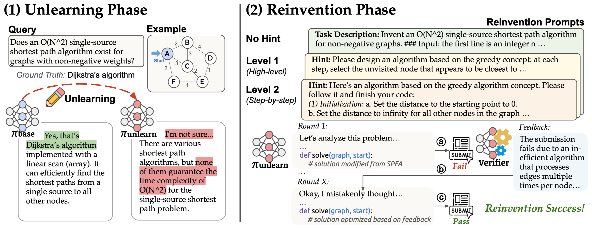

<div align="center">
    <h1 align="center">Can Large Language Models Reinvent Foundational Algorithms?</h1>

**Jian Zhao\*, Haoren Luo\*, Yu Wang, Yuhan Cao, Pingyue Sheng, Tianxing He**

[](https://arxiv.org/abs/2604.05716) [](https://huggingface.co/spaces/jzhao1122/qwen3-thinking-dijkstra) [](https://huggingface.co/algo-reinvention)

</div>

---

We propose an *Unlearn-and-Reinvent* pipeline to test whether LLMs can reinvent foundational algorithms after unlearning them. Across 10 algorithms, 3 models, and 3 hint levels, the strongest model reinvents 50% with no hint, 70% with high-level hints, and 90% with step-by-step hints, while test-time reinforcement learning enables success on harder cases. Our analyses reveal that a generative verifier is critical to preventing "thought collapse" during reinvention.



<p align="center">
  <a href="https://drive.google.com/file/d/1pGTSQbWDgvRR0SVODLv_yQ2jSOGIQKXr/view?usp=sharing">Watch the Dijkstra reinvention demo video</a>
</p>

## Quick Start

> This repository offers four ways to get started:
> 1. Download our unlearned models from Hugging Face and chat with them directly (§[Chat with an Unlearned Model](#chat-with-an-unlearned-model))
> 2. Set up the reinvention environment and let unlearned models reinvent algorithms (§[Run Reinvention Process](#run-reinvention-process))
> 3. Reproduce the GRPO-based on-policy unlearning described in the paper (§[Run Unlearning Pipeline](#run-unlearning-pipeline))
> 4. Run Test-Time Reinforcement Learning during reinvention (§[Test-Time Reinforcement Learning](#test-time-reinforcement-learning))

> **NOTE**: We have significantly refactored the codebase for clarity and simplicity — if you encounter any issues, please feel free to open an Issue.

### Installation
This repo mainly relies on two separate conda environments for different components. To get started, copy `.env.example` to `.env`, set `PROJECT_ROOT` to the local path of this repository, and configure the `CONDA_VLLM` and `CONDA_VERL` paths accordingly.:

**`CONDA_VLLM` environment**

```bash
conda create -n vllm python=3.10 -y
conda activate vllm
pip install "vllm>=0.14"
pip install flash-attn --no-build-isolation
# other packages
pip install math-verify colorama
```

**`CONDA_VERL` environment**

```bash
conda create -n verl python=3.10 -y
conda activate verl
cd unlearn
pip install -e .
pip install -r requirements.txt
pip install flash-attn --no-build-isolation
```

Specifically, if you would like to train a Ministral model, you need to create the `CONDA_VERL_MINISTRAL` environment and set it in .env.

**`CONDA_VERL_MINISTRAL` environment**

```bash
conda create -n verl_ministral --clone verl
conda activate verl_ministral
pip install "vllm==0.14.1"
pip install "transformers==5.0.0rc0"
```

For BFCL evaluation, please following guidance in [bfcl](https://github.com/ShishirPatil/gorilla/tree/main/berkeley-function-call-leaderboard) to create the `CONDA_BFCL` environment and set it in .env.

### Chat with an Unlearned Model

If you want to talk to the unlearned model downloaded from [huggingface website](https://huggingface.co/algo-reinvention), you only need an environment with `vllm>=0.14`.

```bash
conda create -n vllm python==3.10
conda activate vllm
pip install "vllm>=0.14"

python chat_vllm.py --model-path /path/to/model
```

### Run Reinvention Process

First initialize the final-test data and calibrate a machine-specific runtime threshold:

```bash
bash preprocess/scripts/initialize.sh
```

Then run reinvention through the unified `_run.sh` entrypoint:

```bash
export CUDA_VISIBLE_DEVICES="<GPU_IDS>"
bash simple_parallel/scripts/_run.sh \
    TYPE=BASE \
    BENCHMARKS=final \
    BASE_MODEL="<BASE_MODEL>" \ # model family, e.g. qwen3-4b-thinking-2507
    MODEL_PATH="<MODEL_PATH>" \ # downloaded checkpoint path, e.g. /path/to/downloaded/model
    TEST_CATEGORY="<TEST_CATEGORY>" \ #e.g. graph-sp-dijkstra
    LEVEL="<LEVEL>" # 0/1/2
```

See [simple_parallel/README.md](simple_parallel/README.md) for more details.

### Run Unlearning Pipeline

For full unlearning runs, config composition, and training entrypoints, see [unlearn/README.md](unlearn/README.md).
For evaluation of Forgetting Rate and general performance, see [simple_parallel/README.md](simple_parallel/README.md).

### Run Test-Time Reinforcement Learning

For test-time discovery and reinvention search, see [ttt_discover/README.md](ttt_discover/README.md).

## Citation
```
@misc{zhao2026largelanguagemodelsreinvent,
    title={Can Large Language Models Reinvent Foundational Algorithms?}, 
    author={Jian Zhao and Haoren Luo and Yu Wang and Yuhan Cao and Pingyue Sheng and Tianxing He},
    year={2026},
    eprint={2604.05716},
    archivePrefix={arXiv},
    primaryClass={cs.AI},
    url={https://arxiv.org/abs/2604.05716}, 
}
```
